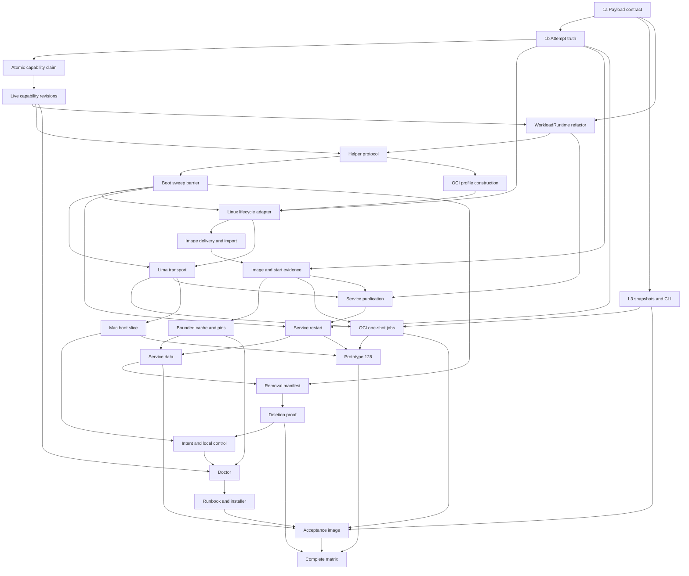

# M3 `kind=oci` implementation wave draft

This is paste-ready issue text, not implementation. Titles are stable dependency keys: copy every `Blocked by:` title exactly when creating GitHub edges. One ticket is explicitly gated by an `OWNER CALL NEEDED`: the bounded-cache ticket cannot launch until the owner fixes its default ceiling.

## Wave rules

- Each ticket is sized for one Codex session and lands its own acceptance slice.
- Every code ticket extends `service_acceptance`. Linux-native runtime behavior also grows `service_acceptance_realtiming`; Mac/Lima runtime behavior is proved only on the attended owner-hardware lane built around #128 because GitHub-hosted Apple-silicon runners cannot boot nested Lima `vz`.
- #128 is the first separately dispatched OCI hardware lane once its minimum Mac boot blockers land. Earlier assertions extend existing jobs; they do not create a competing hardware lane.
- Real lifetime boundaries use built helper/agent/payload processes. Exhaustive contract and error matrices may use fakes.
- `kind` and `class` remain independent; domain class never enters the generic runtime seam.
- For pre-1.0 SQLite, add new tables through direct `CREATE TABLE IF NOT EXISTS`; do not touch `l3/store.go`'s existing `ensureSQLiteColumn` mechanism. Tests delete stale L1/agent DB, WAL, and SHM files rather than inventing another migration system.
- Every commit is DCO-signed with a why body. No ticket may bypass Fabric, expose raw containerd, or create a second OCI command family.

## Dependency graph

## Ticket 1a — M3 OCI payload contract: schema, validation, and fixtures

### Question

How do all wire surfaces express an OCI payload without breaking process jobs?

### Deliverable

- Add the complete `execution.oci` arm, optional-initial-one-shot digest rule, argv/container working directory, mounts, limits, runtime handler, and reserved-name validation to Go contracts, schema, OpenAPI, fixtures, and construction sites.
- Keep the open `kind` enum and process arm compatibility.

### Acceptance

- Schema and Go validation agree on every valid/invalid cross-arm case; v1 process fixtures stay byte-compatible.
- Reserved-name and mount target fixtures cover all five M3 names.
- Run full gates.

### Out-of-scope

No result arms, L3 UX, scheduling, or runtime.

**Spec sections:** §1.1.

**Blocked by:** none.

## Ticket 1b — M3 OCI attempt truth: result arms, `Started`, and pre-start requeue

### Question

How does L1 distinguish claimed work, authoritative OCI start, pre-start infrastructure loss, and post-start runtime loss?

### Deliverable

- Add fenced image observations, idempotent `Started`, `runtime_failure`, termination cause/OOM evidence, and classifier defaults.
- Kind-gate renewal/log/completion implicit promotions so only `Started` makes OCI running.
- Implement terminal old-attempt evidence plus atomic authority revocation and `claimed → queued`, with persisted budget/backoff and replay safety.

### Acceptance

- Result arms are exclusive; absent classifier codes are terminal; OOM is additive.
- Tests cover all three forbidden implicit promotions, stale fences, replay, budget exhaustion, and transition tables.
- Add contract assertions to both tagged suites; run full gates.

### Out-of-scope

No real helper `Started` source or image transfer.

**Spec sections:** §1.3, §4.1.

**Blocked by:** M3 OCI payload contract: schema, validation, and fixtures.

## Ticket 2 — M3 image programs: full L3 snapshots and CLI submission

### Question

How does the complete image program reach one-shot and service-class jobs through existing surfaces?

### Deliverable

- Persist reference, digest, argv, working directory, mounts, limits, and runtime handler in immutable L3 snapshots and copy them unchanged on dispatch/rerun.
- Add existing-family image flags and Pinned routing enforcement.
- Resolve service-class tags by registry HEAD in `services create`; L1 also requires the digest.
- Add echo `--once` behavior.

### Acceptance

- Golden tests prove no snapshot field is lost/defaulted and reruns never re-resolve.
- CLI/API tests cover exclusive sources, service digest, pinning bypass, and missing-resolution rerun rejection.
- Run full gates.

### Out-of-scope

No image download, platform selection, or runtime.

**Spec sections:** §1.2, §9.1.

**Blocked by:** M3 OCI payload contract: schema, validation, and fixtures.

## Ticket 3 — M3 OCI eligibility: required capabilities in atomic claim

### Question

How does L1 claim only onto a node that can execute the requested kind, handler, and limits?

### Deliverable

- Persist `RequiredCapabilities(JobSpec)` output at creation and anti-join it in the winning claim mutation.
- Reuse the module for diagnostics; keep capabilities distinct from slots.

### Acceptance

- Capable/incapable pairs cover open kinds, handlers, cgroup v2, both classes, and concurrent claims.
- Unknown kinds stay queued with a missing `kind:<name>` reason until a node advertises it.
- Run full gates.

### Out-of-scope

No live updates or probe.

**Spec sections:** §3.

**Blocked by:** M3 OCI attempt truth: result arms, `Started`, and pre-start requeue.

## Ticket 4 — M3 live OCI capability: revisioned functional probes

### Question

How does a node earn, lose, and regain OCI eligibility without stale health minting authority?

### Deliverable

- Add boot-scoped full-set revisions, atomic replay/conflict rules, bounded L1 observation metadata, and one agent snapshot module.
- Define the probe interface and local admission suppression; later adapters supply the real probe.
- Keep capability observation independent of `claims_enabled`.

### Acceptance

- One failed probe suppresses local OCI starts immediately; withdrawal becomes L1-visible by the next successful heartbeat. Test those deadlines separately.
- Stale boot/revision, re-registration, missing-capability metadata, and recovery require a newer successful observation.
- Run full gates.

### Out-of-scope

No containerd implementation or payload.

**Spec sections:** §3, §8.3.

**Blocked by:** M3 OCI eligibility: required capabilities in atomic claim.

## Ticket 5 — M3 agent runtime seam: refactor process into `WorkloadRuntime`

### Question

Where does the runtime seam go without leaking class into a generic adapter?

### Deliverable

- Add runtime-neutral request/result and `ReapAndVerify`, selected by open `kind`.
- Move executable materialization into the process adapter without changing Guardian, logs, readiness, or idle behavior.

### Acceptance

- Full process acceptance and realtiming lanes remain unchanged.
- An unknown kind remains unschedulable through missing capability; if a matching future adapter is absent locally, local admission refuses it without affecting siblings.
- Run full gates.

### Out-of-scope

No OCI helper or adapter.

**Spec sections:** §5.2, §5.3.

**Blocked by:** M3 OCI payload contract: schema, validation, and fixtures; M3 live OCI capability: revisioned functional probes.

## Ticket 6a — M3 OCI helper protocol and session authority

### Question

What narrow privileged protocol owns containerd mechanics and Guardian-equivalent session lifetime?

### Deliverable

- Add `__wefty_oci_helper` and versioned RPCs for `EnsureImage`, `Run`, `Signal`, `Watch`, `Delete`, `Verify`, `Sweep`, and `DialAttemptPort`.
- Add peer authentication, exclusive session capability, monotonic heartbeat/deadmen, deterministic identities, and create-vs-sweep serialization.
- Add an attempt-authorized guest→host bridge reverse-tunnel verb only as the Mac fallback.

### Acceptance

- Wrong peer/version, EOF, heartbeat blackhole, stale session, and unauthorized port/bridge access fail closed.
- Realtime runs a real helper child with fake engine operations.
- Run full gates.

### Out-of-scope

No sweep policy, containerd adapter, or packaging units.

**Spec sections:** §2.2, §5.1, §5.2.

**Blocked by:** M3 live OCI capability: revisioned functional probes; M3 agent runtime seam: refactor process into `WorkloadRuntime`.

## Ticket 6b — M3 OCI boot sweep barrier and stale-state recovery

### Question

How does a new helper/agent session prove stale runtime authority absent before advertising OCI?

### Deliverable

- Implement exclusive takeover, sweep-all, verify, pending-removal resume, probe, and capability-publication ordering.
- Label leases/resources before creation and sweep on helper restart; never adopt survivors.

### Acceptance

- Reused boot IDs and crashes after each create boundary leave no unsweepable residue or duplicate execution.
- No OCI badge or claim precedes successful sweep/verify/probe.
- Grow Linux realtiming with deadman and sweep timing; run full gates.

### Out-of-scope

No OCI spec construction or deletion manifest.

**Spec sections:** §5.2.

**Blocked by:** M3 OCI helper protocol and session authority.

## Ticket 7a — M3 OCI v1 profile and guest-side spec construction

### Question

Can the helper serialize the exact v1 profile from image and guest-kernel facts?

### Deliverable

- Generate from containerd v2.3.4 fixtures: user/group, capability sets, seccomp, namespaces, devices, clean env, resolver/hosts, shared network, mounts, and cgroup limits.
- Regenerate/review fixtures on containerd patch changes.

### Acceptance

- Golden specs cover amd64 Linux and arm64 Lima inputs, explicit resolver/`/etc/hosts`, named users, and malicious mounts.
- No raw defaults, reserved env override, or unsupported device escapes validation.
- Run full gates.

### Out-of-scope

No real task lifecycle or image pull.

**Spec sections:** §1.1, §2.

**Blocked by:** M3 OCI helper protocol and session authority.

## Ticket 7b — M3 native Linux OCI lifecycle adapter

### Question

Can an unprivileged Linux agent run and clean a real container through the helper with truthful start evidence?

### Deliverable

- Implement runc v2/overlayfs task create, `Wait` before `Start`, authoritative helper `Started`→L1 acknowledgement, watch/signal/delete, logs, and real probe.
- Provision containerd ≥2.0, runc, and overlayfs explicitly in the `ubuntu-latest` realtiming job before its first real-engine case.

### Acceptance

- Native Linux proves non-root agent/root helper, raw-socket denial, all three implicit L1 promotion paths blocked, exact exit/signal/OOM/runtime loss, and cleanup.
- Linux realtiming runs a pinned local probe at production lease/deadman timings.
- Run full gates.

### Out-of-scope

No registry delivery, cache, Lima, bridge, or service-class job.

**Spec sections:** §1.3, §3, §5.

**Blocked by:** M3 OCI attempt truth: result arms, `Started`, and pre-start requeue; M3 OCI boot sweep barrier and stale-state recovery; M3 OCI v1 profile and guest-side spec construction.

## Ticket 8a — M3 image delivery and offline import

### Question

How does the helper obtain a public image or OCI tarball under one agent-owned budget?

### Deliverable

- Implement helper `EnsureImage`, public resolution/pull/import/unpack, singleflight operation leases, ten-minute tunable agent policy, classifications, and `load-image`.
- Keep `pulling` local and L1 `claimed`.

### Acceptance

- Pull and registry-disabled import yield identical digests; permanent errors fail fast.
- Leader cancellation, engine loss mid-pull, retry-after, and budget exhaustion are covered.
- Grow Linux realtiming with import→run; run full gates.

### Out-of-scope

No cache eviction, private auth, or job identity persistence.

**Spec sections:** §4.1, §4.2.

**Blocked by:** M3 native Linux OCI lifecycle adapter.

## Ticket 8b — M3 image and start evidence across retries

### Question

How does one resolved job identity survive every later attempt and keep `resolved_at` distinct from `started_at`?

### Deliverable

- Persist top-level/platform identity once per job and copy it into attempts/reruns; persist start timestamps only from the landed `Started` path.
- Preserve the same budget/deadline across pre-start retries and never re-pull by tag after resolution.

### Acceptance

- Move a tag after first resolution: every retry/rerun uses the original digest; initial unresolved failure cannot rerun.
- Evidence write/replay/fence tests and `resolved_at < started_at` truth pass.
- Grow Linux realtiming with a pre-start requeue; run full gates.

### Out-of-scope

No eviction or service binding pin.

**Spec sections:** §1.2, §1.3, §4.1.

**Blocked by:** M3 OCI attempt truth: result arms, `Started`, and pre-start requeue; M3 image delivery and offline import.

## Ticket 9 — M3 bounded image cache and service binding pins

> **OWNER CALL NEEDED:** default ceiling (16 GiB proposed by #107). Do not launch until fixed in the spec.

### Question

How does node-owned content stay bounded without evicting live or restart-critical images?

### Deliverable

- Account `wefty` namespace content-store bytes, enforce the ratified cap oldest-unused-first, and record evictions.
- Separate operation/attempt/binding/cache holds and reconcile a durable local binding-pin ledger against L1 before eviction.

### Acceptance

- Saturation preserves probe/live/bound content; restart, concurrent waiters, wipe/repull, and removal pin release are covered.
- Grow Linux realtiming with cache pressure; run full gates.

### Out-of-scope

No fleet prune or removal-triggered image delete.

**Spec sections:** §4.2, §8.3.

**Blocked by:** M3 image and start evidence across retries.

## Ticket 10 — M3 Lima transport and Mac helper tunnel

### Question

Can the Linux helper/runtime contract cross Lima without raw containerd or ambient TCP forwarding?

### Deliverable

- Add rootful Lima template, overlayfs, allowed mount root, helper socket forward, VM-epoch reconnect, and dynamic TCP/UDP forwarding disablement.
- Implement host→guest `DialAttemptPort` and primary guest→host bridge through discovered `host.lima.internal`, using the helper reverse tunnel only on bind failure.

### Acceptance

- The attended Mac `docs/acceptance/` + `service_acceptance` lane proves permissions, probe, task/log/delete, mount validation, both traffic directions, VM/helper loss, and sweep-before-recovery.
- No macOS realtiming-CI claim or hard-coded gateway exists.
- Run full gates.

### Out-of-scope

No boot unit, auto-start, or service lifecycle.

**Spec sections:** §2.2, §2.3, §5.1, §9.1.

**Blocked by:** M3 OCI boot sweep barrier and stale-state recovery; M3 native Linux OCI lifecycle adapter.

## Ticket 11 — M3 OCI one-shot jobs through `kind` alone

### Question

Does an ordinary L3 run execute the echo image solely because `kind=oci`?

### Deliverable

- Connect snapshots to OCI dispatch, reserved env, handoff, bridge, logs, completion, requeue, and rerun identity.

### Acceptance

- Linux realtiming proves `--once`, bridge, streams, digest evidence, crash/loss before and after `Started`, and no duplicate execution.
- The attended Mac lane proves the same contract through Lima; no GitHub-hosted Mac virtualization is claimed.
- Run full gates.

### Out-of-scope

No service-class publication/data/removal.

**Spec sections:** §1, §2.2, §4, §5, §9.2.

**Blocked by:** M3 image programs: full L3 snapshots and CLI submission; M3 image and start evidence across retries; M3 Lima transport and Mac helper tunnel.

## Ticket 12a — M3 OCI service-class publication and readiness

### Question

Can the existing Fabric front door publish an OCI service-class payload without exposing its backend?

### Deliverable

- Wire OCI runtime endpoints into Fabric, allocate loopback ports, inject reserved service names, and support portless `Started`.
- Probe through the same helper tunnel used by forwarding.

### Acceptance

- Linux realtiming covers health/echo, startup timeout, withdrawal/republication, port collisions, and portless behavior.
- The attended Mac lane covers the same through Lima; no Mac realtiming-CI claim.
- Run full gates.

### Out-of-scope

No restart classification, stop quiescence, or persistent data.

**Spec sections:** §2.2, §6, §9.2.

**Blocked by:** M3 agent runtime seam: refactor process into `WorkloadRuntime`; M3 image and start evidence across retries; M3 Lima transport and Mac helper tunnel.

## Ticket 12b — M3 OCI service-class restart and stop quiescence

### Question

How does a service-class job restart as a fresh L1 attempt and stop only after positive runtime quiescence?

### Deliverable

- Implement classification requeue, fresh attempt/backend/listener, sweep embargo, stop TERM/grace/KILL, `stopped` slot release, and start via `queued` capacity reacquisition.

### Acceptance

- Linux realtiming covers payload/agent/helper/engine loss, restart identities, saturation, stop/start, and failure to prove quiescence.
- The attended Mac lane covers VM loss and the same state transitions; no Mac realtiming-CI claim.
- Run full gates.

### Out-of-scope

No persistent service data or removal.

**Spec sections:** §1.3, §6.

**Blocked by:** M3 OCI attempt truth: result arms, `Started`, and pre-start requeue; M3 OCI boot sweep barrier and stale-state recovery; M3 OCI service-class publication and readiness.

## Ticket 13 — M3 OCI service data volume and digest-pinned rebuilds

> **OWNER CALL DEPENDENCY:** transitively blocked on the cache ceiling in Ticket 9.

### Question

What persists across service-class attempts and who owns it?

### Deliverable

- Add helper-owned guest-native service data volumes with one-time UID:GID initialization.
- Retain binding manifest pin/data while rebuilding fresh writable rootfs; reject reserved target shadowing.

### Acceptance

- Linux realtiming covers root/numeric/named users, restart and stop→start persistence, and rootfs discard.
- The attended Mac lane proves guest-native data semantics; it does not use virtiofs or Mac CI virtualization.
- Run full gates.

### Out-of-scope

No migration/carry flag or removal proof.

**Spec sections:** §4.2, §6.

**Blocked by:** M3 bounded image cache and service binding pins; M3 OCI service-class restart and stop quiescence.

## Ticket 14a — M3 OCI removal manifest and resumable state

> **OWNER CALL DEPENDENCY:** transitively blocked on the cache ceiling in Ticket 9.

### Question

How is every runtime-owned resource frozen before destructive removal begins?

### Deliverable

- Persist immutable job/generation/attempt resource manifests, `runtimeQuiesced`, and prepared→quarantined→complete resumption.
- Validate identity before `NotFound`; retain bind handles without traversal.

### Acceptance

- Linux realtiming covers removal entry from every observed state and crash injection around manifest/quiescence.
- The attended Mac lane covers guest resource manifests and offline pending state; no Mac realtiming-CI claim.
- Run full gates.

### Out-of-scope

No directory/spool/data deletion or attestation.

**Spec sections:** §7.

**Blocked by:** M3 OCI boot sweep barrier and stale-state recovery; M3 OCI service data volume and digest-pinned rebuilds.

## Ticket 14b — M3 OCI deletion proof and post-delete attestation

> **OWNER CALL DEPENDENCY:** transitively blocked on the cache ceiling in Ticket 9.

### Question

How does acknowledgement strictly follow complete runtime, log, spool, and data deletion?

### Deliverable

- Implement withdraw/close → reap/verify → spool purge → quarantine/delete/verify → pin release → `agent_cleaned`.
- Add destructive guardrail matrix and retain cached images/operator binds.

### Acceptance

- Linux realtiming inventories every residue class, sensitive spec scrub, force-forget, replay, and phase crash.
- The attended Mac lane proves guest runtime/log/data absence with bind sources untouched; no Mac realtiming-CI claim.
- Run full gates.

### Out-of-scope

No cache prune or new removal state machine.

**Spec sections:** §7, §9.2.

**Blocked by:** M3 OCI removal manifest and resumable state.

## Ticket 15a — M3 Mac boot unit and agent-supervised Lima

### Question

What minimum bootstrap slice lets #128 test the real boot topology early?

### Deliverable

- Install the operator-user `dev.wefty.agent` LaunchDaemon with explicit environment and make the agent the sole Lima supervisor.
- Install/checksum/version the guest helper, socket permissions, probe image, and stopped/Broken bounded recovery.
- Emit minimal structured doctor facts needed by #128: unit, Lima/helper/probe state, capability revision, and sanitized reason.

### Acceptance

- The attended Mac lane proves no Lima autostart unit, correct permissions, process-only degradation, recovery only while enabled, and structured facts.
- Run full gates.

### Out-of-scope

No general doctor UI, local control socket, convergence UX, or Linux units.

**Spec sections:** §8.1, §8.2, §9.1.

**Blocked by:** M3 Lima transport and Mac helper tunnel.

## Ticket 15b — M3 OCI intent, local control, convergence, and Linux units

> **OWNER CALL DEPENDENCY:** transitively blocked on the cache ceiling in Ticket 9.

### Question

How does operator intent survive reboot and govern setup/start/stop without autonomous override?

### Deliverable

- Add operator-only control socket, setup/start/stop, persist-first revisioned intent, convergence classes, probe preload, and Linux systemd agent/helper units with supplementary group restart.
- Preserve disabled intent on setup and coordinate removal-safe stop.

### Acceptance

- Linux systemd CI proves reboot-durable intent when its environment supports reboot; otherwise it emits a structured skip receipt with the missing capability.
- Mac reboot durability is proved only by the #128 attended lane; ordinary Mac runners emit the same structured skip rather than a false pass.
- Run full gates.

### Out-of-scope

No package installation, full doctor, or runbook.

**Spec sections:** §8.1, §8.2.

**Blocked by:** M3 OCI deletion proof and post-delete attestation; M3 Mac boot unit and agent-supervised Lima.

## Ticket 16 — Prototype: headless Mac node returns advertising `oci` after cold reboot (no login, no SSH)

> Existing issue #128. Update and execute it; do not create a duplicate.

### Question

Does the real Mac return with OCI capability and usable workloads after FileVault unlock, no GUI login, and no SSH?

### Deliverable

- Cold reboot, remotely observe a fresh revision, run one-shot and portful service-class jobs, then repeat hostagent and Lima `Broken` recovery.
- Capture launchd/agent/Lima/helper/minimal-doctor/no-console receipts in a `VERDICT.md` artifact.

### Acceptance

- PASS requires advertisement, both workload classes, bind under allowed root, outage withdrawal, bounded recovery, and no login/SSH before advertisement.
- A failure reopens #113 B2 honestly.

### Out-of-scope

No fallback topology without a later owner decision.

**Spec sections:** §8.2, §9.

**Blocked by:** M3 OCI one-shot jobs through `kind` alone; M3 OCI service-class restart and stop quiescence; M3 Mac boot unit and agent-supervised Lima.

## Ticket 17 — M3 node doctor and capability diagnostics

> **OWNER CALL DEPENDENCY:** transitively blocked on the cache ceiling in Ticket 9.

### Question

Can an AI operator see every stable non-advertising fact without mutation or duplicated probe logic?

### Deliverable

- Add matching versioned JSON/human views for every enumerated reason, platform/unit/runtime/helper/probe/intent/cache/mount/convergence fact.
- Read shared recorded probe facts and sanitize local detail.

### Acceptance

- Golden parity covers every §8.3 code and L1 metadata tuple; doctor performs no setup/probe/restart.
- Linux realtiming bundles before/after doctor JSON; Mac #128 may consume the full view after this lands but does not block on it.
- Run full gates.

### Out-of-scope

No mutation or automatic recommendation.

**Spec sections:** §3, §4.2, §8.3.

**Blocked by:** M3 live OCI capability: revisioned functional probes; M3 bounded image cache and service binding pins; M3 OCI intent, local control, convergence, and Linux units.

## Ticket 18 — M3 OCI runbook and prerequisite install script

> **OWNER CALL DEPENDENCY:** transitively blocked on the cache ceiling in Ticket 9.

### Question

Can an operator reproduce setup and optionally install only supported prerequisites?

### Deliverable

- Add `docs/runbooks/oci-node.md` and idempotent Homebrew/Debian/Ubuntu/Fedora prerequisite script with no third-party repos, CNI, or wefty mutation.
- Document versions, intent, convergence, FileVault/TCC, mounts, cache owner call, helper permissions, and doctor codes.

### Acceptance

- Script matrix covers supported, rerun, unknown, and below-minimum cases; docs commands are checked.
- Evidence links exact runbook revision; run full gates.

### Out-of-scope

No arbitrary distro or fleet package orchestration.

**Spec sections:** §8.

**Blocked by:** M3 node doctor and capability diagnostics.

## Ticket 19 — M3 acceptance image: public multi-arch GHCR and OCI tarball

> **OWNER CALL DEPENDENCY:** transitively blocked on the cache ceiling in Ticket 9.

### Question

How does CI publish one immutable echo artifact for both delivery paths and workload classes?

### Deliverable

- Add the illustrative `examples/` Dockerfile and main-only amd64/arm64 GHCR publish, commit tag, index digest, and OCI tarball artifact.
- Keep PR tests secretless and digest-only.

### Acceptance

- Manifest inspection proves both platforms; pull and offline import execute identical identity.
- Linux realtiming consumes the published digest on main; the Mac attended runbook names the same digest.
- Run full gates and workflow validation.

### Out-of-scope

No node builds, private registry, or blessed base image.

**Spec sections:** §9.1.

**Blocked by:** M3 image programs: full L3 snapshots and CLI submission; M3 OCI one-shot jobs through `kind` alone; M3 OCI service data volume and digest-pinned rebuilds; M3 OCI runbook and prerequisite install script.

## Ticket 20 — M3 complete OCI acceptance matrix

> **OWNER CALL DEPENDENCY:** transitively blocked on the cache ceiling in Ticket 9.

### Question

Does the landed wave satisfy both platforms, both classes, crash, removal, residue, engine loss, and delivery paths?

### Deliverable

- Complete Linux PR and realtiming assertions with the canonical image.
- Fold the attended Mac `docs/acceptance/` + `service_acceptance` artifact and #128 verdict into the matrix; never claim Lima from GitHub-hosted Mac CI.
- Upload structured versions, digests, IDs, revisions, timings, doctor snapshots, skips, and residue inventories.

### Acceptance

- Every §9 matrix cell has a positive assertion or an explicitly required structured skip; Mac/Lima destination success requires attended PASS evidence.
- Linux reruns from empty cache and stale residue; `service_acceptance` stays in `all-tests-pass`, Linux OCI realtiming stays main/weekly evidence.
- Run full gates and tagged suites.

### Out-of-scope

No new capability implementation; route gaps to their owning ticket.

**Spec sections:** §9 in full.

**Blocked by:** M3 OCI deletion proof and post-delete attestation; Prototype: headless Mac node returns advertising `oci` after cold reboot (no login, no SSH); M3 acceptance image: public multi-arch GHCR and OCI tarball.
