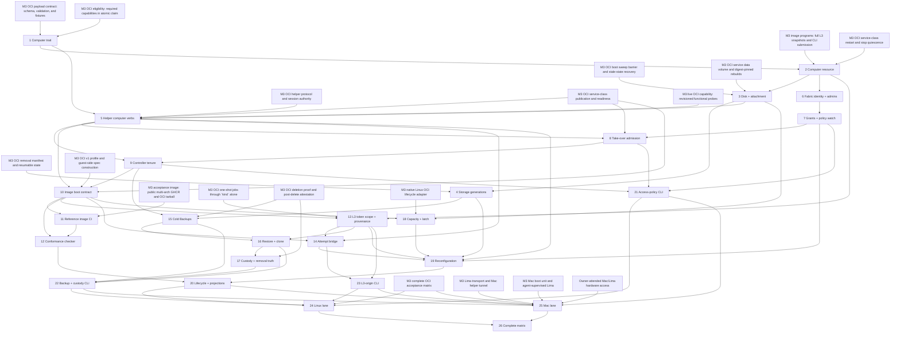

# Agent-computer implementation wave draft

This is paste-ready issue text, not implementation. Titles are stable dependency keys: copy every `Blocked by:` title exactly when creating GitHub dependency edges. The owner ratified **M3.5 — Agent computers** plus CLI defaults of 1 GiB memory, 8 GiB fully allocated disk, and a shipped cluster Backup cap of 0 on 2026-08-23.

## Wave rules

- Each ticket is sized for one Codex session of roughly 100K tokens and lands its own acceptance slice.
- Every code ticket extends `service_acceptance`. Linux-native runtime behavior also grows `service-acceptance-realtiming`; Mac/Lima behavior is proved only by the attended owner-hardware lane.
- M3 tickets are named exactly as GitHub currently names the `wave:m3-oci` issues. A closed M3 blocker means its contract must already be consumed, not reimplemented.
- Contract, OpenAPI, schema, state-machine, and helper-protocol documentation changes land with their owning code.
- Real authority/lifetime claims use built processes and real Fabric/helper boundaries where hardware permits. Exhaustive conflict/error matrices may use fakes and injected clocks.
- No ticket creates a `kind=computer`, `class=computer`, `computers` CLI family, generic VNC adapter family, public ingress path, numeric capability, or second removal state machine.
- For pre-1.0 SQLite, add direct `CREATE TABLE IF NOT EXISTS` tables and preserve current repo migration conventions. Tests remove stale DB/WAL/SHM files rather than inventing a migration framework.
- Every commit is DCO-signed with a why body. Every ticket runs the full repo gates when it touches Go/workflow code.

## Ratified owner calls (2026-08-23)

1. **Milestone:** **M3.5 — Agent computers**, inserted between M3 OCI and M4 Daytona; M4/M5 names and numbers remain unchanged.
2. **Materialized defaults:** 1 GiB memory, 8 GiB fully allocated disk, and Backup cap 0. A positive per-Computer cap or configured cluster default enables Backups; the effective value is stored explicitly.

The wave has 26 implementation tickets. No ticket remains owner-call blocked; the attended Mac lane still requires owner hardware.

## Dependency graph

## Ticket 1 — Agent computer trait: contracts, capability, and Pinned placement

### Question

How does a Computer remain an OCI service Job without inventing a new kind, class, or scheduling axis?

### Deliverable

- Add `execution.oci.computer.display.protocol=rfb-websocket-v1` and positive `disk_bytes`, with positive explicit OCI `memory_bytes` required for the trait.
- Add `RequiresPinnedPlacement(spec)`, exactly-one stable-node-tag enforcement, job-side `computer` capability requirement derivation, and the computer-only `published_port` prohibition across Go, JSON Schema, OpenAPI, fixtures, and construction sites.
- Amend the M3 reserved-name set declarations without yet injecting the new values.

### Acceptance

- Schema and Go agree on every kind/class/digest/protocol/port/tag/positive-int boundary, including overflow and null/empty objects.
- A Computer claim requires `computer`; a `kind:oci`-only Node cannot claim it, and process/plain-OCI fixtures stay byte-compatible.
- Contract tests prove no new kind, class, desired state, attempt state, or numeric capability.

### Out-of-scope

No durable Computer record, disk mechanics, helper endpoints, or CLI defaults.

**Spec sections:** §1, §11 item 6.

**Blocked by:** M3 OCI payload contract: schema, validation, and fixtures; M3 OCI eligibility: required capabilities in atomic claim.

## Ticket 2 — Computer resource: intent revisions and immutable Job projections

### Question

How does one durable Computer own desired state while successive immutable service Jobs remain runtime projections?

### Deliverable

- Add Computer identity/name/placement/binding/grants/storage reference, revisioned intent/history, applied revision, current Job/spec revision, and fenced reconfiguration phase.
- Make Computer desired state the sole authority; serialize start/stop/remove and projection changes under CAS while old Jobs become permanently non-startable.
- Transfer binding/Slot ownership atomically without conflating `computer_id` and `job_id`.

### Acceptance

- Stale revisions and competing mutations no-op with typed conflicts; removal forecloses every new Job/attempt.
- Stop releases the Slot while retaining binding/storage charge/image pin/grants; start reacquires exactly once.
- Plain service lifecycle and image-change semantics remain unchanged.

### Out-of-scope

No disk attachment, reimage/reset/resize orchestration, sessions, or Storage provenance.

**Spec sections:** §2.1.

**Blocked by:** Agent computer trait: contracts, capability, and Pinned placement; M3 image programs: full L3 snapshots and CLI submission; M3 OCI service-class restart and stop quiescence.

## Ticket 3 — Computer disk image and exactly-one attachment

### Question

Can the helper create one fully allocated persistent disk and prove that no two attempts attach it?

### Deliverable

- Replace the trait's ordinary service-data directory with a helper-owned, fully preallocated loop-backed ext4 image mounted at `/wefty/service`, with zero reserved blocks and bounded tenant-writable paths.
- Persist attachment metadata outside tenant storage and require consumed `ReapAndVerify` or named prior-boot sweep evidence before any next attach.
- Make allocation, mount, loop, quota, and attachment state enumerable for later removal.

### Acceptance

- Forced `ENOSPC` before `Started` leaves no partial image, loop, mount, or manifest.
- Attempt B cannot attach while A owns the generation; stale fence and lock disappearance cannot detach or authorize B.
- Helper death blocks reattachment until sweep proof; reboot retains bytes, adopts no survivor, and attaches exactly once afterward.

### Out-of-scope

No reset generations, Backups, cap-sum memory admission, or deletion outcome.

**Spec sections:** §3.1, §4 disk mechanics.

**Blocked by:** Computer resource: intent revisions and immutable Job projections; M3 OCI boot sweep barrier and stale-state recovery; M3 OCI service data volume and digest-pinned rebuilds.

## Ticket 4 — Storage generations and reset lifecycle

### Question

How does reset replace storage without ever attaching two generations or acknowledging deleted bytes prematurely?

### Deliverable

- Add `storage_id`, monotonic Storage generations, current/staging/retired phases, generation-bound attempt evidence, and crash-resumable reset ordering.
- Persist intent, quiesce/detach, quarantine/delete/verify the old generation, then publish and attach a new empty generation only if the revision still owns the operation.
- Keep Storage generation distinct from removal and authority generations.

### Acceptance

- Crash injection at every reservation, detachment, quarantine, deletion, verification, publication, and attach boundary resumes exactly once.
- No observable state permits two current/attached generations; stale helper receipts cannot advance a newer revision.
- Reset preserves Computer/storage identity, name, placement, grants, and explicit budget while old bytes and planted credentials are unreachable.

### Out-of-scope

No Backups/restore/clone, reimage, grow, sessions, or composite Computer removal.

**Spec sections:** §2.2 reset, §3.1.

**Blocked by:** Computer disk image and exactly-one attachment; M3 OCI removal manifest and resumable state.

## Ticket 5 — OCI helper computer endpoints and control-state verb

### Question

What smallest helper extension supports two display roles and the tenant-visible driving signal without becoming a guest dialer?

### Deliverable

- Amend `Run` to return a bounded named endpoint set and `DialAttemptPort` to authorize only current returned names.
- Add `SetComputerControlState(attempt_authority, human_driving)` and reserved, read-only, attempt-local `/wefty/control/driver.json` outside persistent storage.
- Retain the existing constrained `DialHostBridge` fallback for Computer guest authority.
- Derive node-side `computer` support only from a helper protocol version carrying those Computer verbs/semantics, and advertise it in a fresh boot-scoped capability revision on the M3 #136 pattern.

### Acceptance

- Missing, duplicate, unexpected, arbitrary-port, stale-fence, old-boot, and reaped-attempt calls fail closed.
- Signal writes are atomic, image-user-readable, unwritable, unshadowable, false on every fresh attempt, and absent from disk evidence.
- Helper/session loss reaps named endpoints and control state under the existing boot barrier.
- Unsupported helper versions never advertise `computer`; helper restart/sweep publishes a newer revision, and stale boot-scoped capability revisions cannot satisfy claim.

### Out-of-scope

No WhoIs, authorization policy, controller arbitration, readiness probing, or L3 credential.

**Spec sections:** §6 signal seam, §7 endpoints, §11 items 7–8 and 10.

**Blocked by:** Agent computer trait: contracts, capability, and Pinned placement; Computer disk image and exactly-one attachment; M3 live OCI capability: revisioned functional probes; M3 OCI helper protocol and session authority; M3 OCI service-class publication and readiness.

## Ticket 6 — Fabric person identity and admin bootstrap

### Question

How does the Fabric identify one person across devices and establish the first durable administrator without trusting a remote first caller?

### Deliverable

- Extend wefty-owned `fabric.Identity` with opaque stable User and Device IDs; translate tsnet identities and add explicit plain-Fabric test/dev identities.
- Add durable admin policy, one-time locally initiated WhoIs-authenticated bootstrap, CAS mutations, final-admin protection, and atomic policy audit rows.
- Preserve the actnel litmus and principal separation.

### Acceptance

- Login rename changes nothing; two devices map to one person while keeping distinct device evidence.
- Bootstrap nonce replay, remote first-caller, nonadmin mutation, stale CAS, and final-admin removal all fail.
- No Tailscale type, display login, MagicDNS name, or device-as-person policy crosses the seam.

### Out-of-scope

No per-Computer grants, Node policy watch, endpoint admission, or control arbitration.

**Spec sections:** §5.1.

**Blocked by:** Computer resource: intent revisions and immutable Job projections.

## Ticket 7 — Computer grants, policy distribution, and live revocation

### Question

How does durable `view|control|none` intent reach the bound Node and close live authority under partitions?

### Deliverable

- Add current per-Computer/User grants, monotonic policy revisions, admin overrides, CAS/list/replay semantics, and immutable mutation audit.
- Distribute L1-generation/Node/boot-bound snapshots through a fast watch with freshness deadlines and explicit install acknowledgements.
- Report revocation `pending` until Node ack and `completed` only after matching sessions are closed.

### Acceptance

- Closed-by-default, upgrade/downgrade/revoke, newer-revoke-never-reveals-older, admin removal, revision regression, generation change, watch loss, and injected-clock expiry all fail closed.
- Persisted policy is never loaded after agent restart; heartbeat only bootstraps.
- Ordinary published services remain byte-compatible and do not acquire this policy gate.

### Out-of-scope

No WhoIs connection handling, session record, backend dial, or tenure.

**Spec sections:** §5.1–§5.2 policy distribution.

**Blocked by:** Fabric person identity and admin bootstrap.

## Ticket 8 — Take-over admission, bounded sessions, and audit

### Question

Can every Computer streaming connection be authenticated, role-derived, bounded, and admitted to view without any route to control?

### Deliverable

- Add the private Computer admission module: WhoIs per connection, server-derived role, unconditional dial of only the returned `view` backend, ownership of both relay legs, and periodic identity revalidation.
- Add one-hour session cap, attempt/authority cancellation, durable session-open-before-forward and session-close-before-discard audit upload.
- Make the deny-by-default authorizer mandatory for constructing a Computer front door.

### Acceptance

- WhoIs failure, unauthorized identity, client-supplied role/path/header, stale policy, and authority loss close before any backend dial; every successful admission dials `view`, never `control`.
- Revocation/admin removal closes every matching socket before ack; downgrade requires reconnect; cap closes both legs with a fresh identity check on reconnect.
- Viewer traffic and control-authorized admission cannot reach control before a successful session-bound `take`; raw guest/helper endpoints stay unreachable, and audits are idempotent and contain no fence or display data.
- Until the module is active, status may show the Computer marker but the display endpoint is null, never a placeholder URL.

### Out-of-scope

No `take`/`release`, controller lock, driver signal mutation, or tenant UI.

**Spec sections:** §5.2, §6 audit envelope.

**Blocked by:** OCI helper computer endpoints and control-state verb; Computer grants, policy distribution, and live revocation; M3 OCI service-class publication and readiness.

## Ticket 9 — Controller tenure, explicit take/release, and guest signal

### Question

How does exactly one human hold the wheel while every connection begins view-only and the tenant sees truthful driving state?

### Deliverable

- Add a node-local `(computer, active attempt)` Controller-tenure lock with explicit session-bound `take`/`release`, no restart restoration, first-driver retention, nonadmin busy behavior, and serialized admin override.
- Keep L1 as the owner of policy and evidence, never the lock; rely on Pinned binding, fencing, and authority deadlines to prevent two Nodes from serving one Computer.
- Order relay close/observation, audit, `SetComputerControlState`, and new control dial so no two input paths overlap and signal truth leads input truth.
- Clear tenure on every disconnect/revocation/cap/attempt/authority path; never add idle release or pause the tenant process.

### Acceptance

- Two concurrent nonadmin takes yield one controller; unlimited viewers and control-authorized viewers have no input effect before take.
- Admin connect is not override; explicit override closes and observes old relay first; a successful replacement preserves literal `{"version":1,"human_driving":true}` throughout, while replacement-backend failure writes `{"version":1,"human_driving":false}` and returns tenure to Free.
- Signal-set failure denies control; unconfirmed clear withdraws/reaps; stale/non-holder operations no-op; every envelope event and privacy exclusion is asserted.

### Out-of-scope

No custom RFB messages, input recording, display overlay, or tenant etiquette.

**Spec sections:** §6.

**Blocked by:** OCI helper computer endpoints and control-state verb; Take-over admission, bounded sessions, and audit.

## Ticket 10 — Computer image boot contract and atomic readiness

### Question

Can any tenant image expose the fixed display contract under unchanged M3 walls without numeric ports or injected desktop machinery?

### Deliverable

- Allocate/inject distinct reserved view/control ports, strip `WEFTY_SERVICE_PORT`, preserve `WEFTY_SERVICE_DIR`, and keep image ENTRYPOINT/CMD/USER semantics.
- Implement the fixed `rfb-websocket-v1` request path `/websockify`, `binary` WebSocket subprotocol, binary-only RFB framing with text rejection, and upgrade-plus-RFB-banner readiness on both tunnels, with atomic publish/withdraw/republish and exact 60-second `startup_readiness_timeout`.
- Add private 1 GiB `/dev/shm` and serialized OCI-profile fixtures; document the BYO desktop boundary.

### Acceptance

- Two Computers get four unique loopback ports; `0.0.0.0` is forbidden, and image/operator reserved overrides plus labels/fixed ports cannot influence allocation.
- Wrong path/subprotocol, text frame, partial/TCP-only endpoints, and the 60-second deadline publish nothing with exact owning failure; loss of either withdraws both without killing the payload and recovery requires both.
- Serialized specs prove USER, caps, seccomp, namespaces, pseudo-devices, shm flags/charge, no new privilege/GPU, and no tenant-agent health requirement.

### Out-of-scope

No reference image, conformance CLI, auth policy, browser sandbox repair, or GPU/audio.

**Spec sections:** §7, §11 item 2.

**Blocked by:** OCI helper computer endpoints and control-state verb; Controller tenure, explicit take/release, and guest signal; M3 OCI v1 profile and guest-side spec construction; M3 OCI service-class publication and readiness.

## Ticket 11 — Reference desktop image and multi-arch CI

### Question

How does wefty ship an optional working Computer artifact without creating a required base image?

### Deliverable

- Add `examples/computer/` Debian/XFCE/Chromium with two server-side RFB-over-WebSocket roles, deterministic input-oracle surface, and image-owned `$HOME` symlink.
- Extend the M3 artifact workflow to publish one public amd64/arm64 GHCR index by digest and an OCI tarball.
- Add `docs/guides/computer-images.md` with exact optional-artifact/security-boundary wording and disclose CPU rendering/Chromium `--no-sandbox`.

### Acceptance

- Manifest inspection proves both platforms; PRs remain secretless; Linux and attended Mac consume the identical digest/tar identity.
- Profile/sign-in markers survive fresh attempts and stop/start while writable rootfs does not.
- Generic OCI examples and the `wefty-echo-service` artifact remain separate and unchanged.

### Out-of-scope

No blessed base, hosted desktop, browser sandbox expansion, GPU, or tenant-agent product.

**Spec sections:** §7 reference images, §10 lane rules, §11 item 5.

**Blocked by:** Computer image boot contract and atomic readiness; M3 acceptance image: public multi-arch GHCR and OCI tarball.

## Ticket 12 — Computer image conformance checker

### Question

Can an image author prove compatibility and input separation without a false PASS when no oracle exists?

### Deliverable

- Add `wefty-computer-conformance` as a script/tagged test over boot, environment, named endpoints, readiness, signal permissions, persistence boundary, privilege profile, and optional input oracle.
- Add the reference oracle and negative fixtures for missing/duplicate endpoints, plain TCP, view accepting input, writable signal, reserved overrides, and forbidden privilege.
- Emit structured PASS/FAIL/NOT-RUN evidence.

### Acceptance

- Control input changes the deterministic surface while byte-identical view input does not.
- Author images without an oracle report input isolation `NOT-RUN`; no aggregate PASS hides that cell.
- Negative fixtures fail at the owning boundary with stable reasons and no leaked credential/port.

### Out-of-scope

No image certification service, adapter registry, visual-quality metric, or tenant-agent health.

**Spec sections:** §7 conformance.

**Blocked by:** Computer image boot contract and atomic readiness; Reference desktop image and multi-arch CI.

## Ticket 13 — L3 Computer token scope and Run provenance

### Question

How does L3 recognize an attempt-bound Computer principal without turning the Computer into a Run, Node, or durable cluster account?

### Deliverable

- Add admin-only revisioned `submit_enabled`, `ComputerTokenScope`, per-attempt 256-bit minting, digest-only persistence, immutable issuance/revocation audit, grant synchronization, and L3 authority-generation invalidation.
- Bind the grant to Computer, attempt, Storage generation, submit-intent revision, host Node, and L3 authority generation; derive provenance only from that scope and reject caller-supplied provenance.
- Extend `run_triggers` with immutable Computer origin for ordinary root Runs while descendants retain `type=chain`; never mint or inject `WEFTY_RUN_TOKEN` for a Computer.

### Acceptance

- Default off yields no endpoint or token; enabled readiness requires a minted, L3-verified active-attempt credential, while L3/grant-sync failure injects neither, yields exact `pass_unavailable`, and never becomes ready.
- Plaintext appears nowhere durable or observable; restored credentials, earlier generations, old L3 authority, and same-attempt tokens revoked before re-enable all fail.
- Provenance is exact and unforgeable; every submission is an ordinary root, and reconfiguration creates no Run.

### Out-of-scope

No bridge transport, HTTP routes, inflight limiter, CLI origin query, capability broker, or L1 principal.

**Spec sections:** §1.2, §8 credential/provenance.

**Blocked by:** Computer resource: intent revisions and immutable Job projections; Computer image boot contract and atomic readiness; M3 OCI one-shot jobs through `kind` alone.

## Ticket 14 — Computer attempt bridge surface, transport, and inflight limit

### Question

Can an enabled tenant submit and observe only its own current-generation roots through a bounded transport with truthful revocation?

### Deliverable

- Inject sensitive `WEFTY_COMPUTER_TOKEN` and `WEFTY_L3_ENDPOINT` only after L3 verification; start a Linux-loopback or Mac gateway-primary attempt bridge with constrained `DialHostBridge` fallback and no LAN bind.
- Implement only `/self`, root `POST /runs`, and paginated status/Run-Lineage/log/accepted-Envelope reads for current-generation roots and descendants; mirror the allowlist only as defense in depth while L3 asserts identity.
- Add revisioned `submit_max_inflight` default 20 with atomic nonterminal-root-Lineage enforcement; commit L3 revocation before disable success, close reachability/inflight traffic afterward, and mint a different token on same-attempt re-enable.

### Acceptance

- `/self` returns only bound identity, generation, grant revision, and permissions; foreign/earlier reads and Envelope/Gate appends, cancel, rerun, Workflow/L1/grant admin, and parented submit fail before data.
- Forged headers change nothing; 19→20, concurrent submission, idempotent replay, terminal release, and generation races pass.
- Linux loopback, Mac gateway-primary, forced helper fallback, no `0.0.0.0`, disable ordering, and every attempt/lease/helper/agent/reconfiguration/removal revocation path pass.

### Out-of-scope

No rate limit, general guest network proxy, cross-Computer history, or CLI origin projection.

**Spec sections:** §8.

**Blocked by:** L3 Computer token scope and Run provenance; OCI helper computer endpoints and control-state verb; Computer image boot contract and atomic readiness.

## Ticket 15 — Cold Backup creation and managed copy lifecycle

### Question

Can wefty take a fully accounted cold copy without resuming stale intent or leaving untracked secret-bearing bytes?

### Deliverable

- Add Backup, Backup copy, Storage provenance records and planned-copy-before-write phases for one source-node v1 copy.
- Implement disruptive backup intent, quiesce/detach proof, full allocation, copy/digest verification, unchanged-intent resume, explicit pruning, configurable finite cap, and `encryption=none` facts.
- Enumerate staging/copy resources for removal and bind receipts to Node/root-instance/copy/generation/operation.

### Acceptance

- Running resumes only under unchanged intent; stopped stays stopped; stop/remove wins races.
- `ENOSPC`, digest mismatch, and crashes at planning/allocation/copy/verify/publication leave source intact and no untracked copy.
- The shipped cluster default cap is 0; a positive configured cluster or per-Computer cap enables creation, creation at the effective cap fails, and no automatic deletion occurs.
- Permissions deny unrelated local users; browser-secret/user markers survive while wefty authority artifacts are absent.

### Out-of-scope

No hot snapshot, restore, clone, export, encryption layer, or cross-node replica transfer.

**Spec sections:** §3.2, §9.

**Blocked by:** Storage generations and reset lifecycle; Controller tenure, explicit take/release, and guest signal; M3 OCI deletion proof and post-delete attestation.

## Ticket 16 — Restore and clone with Storage provenance

### Question

How do restore and clone preserve user bytes while creating the correct identities and never reviving authority?

### Deliverable

- Implement stopped-only restore to `generation+1` with staging/verification/publication/retirement ordering and optional atomic old-generation-to-Backup choice.
- Restore of the same Computer may preserve machine/app identity; implement cold clone to new Computer/storage identity, required name, no grants, source-or-larger full allocation, filesystem expansion, and narrowly specified OS-identity rekey.
- Record managed custody forks and rotate take-over/guest/attachment authority before any new attach.

### Acceptance

- Restore preserves Computer/storage ID, may preserve `/etc/machine-id`, SSH host keys, and app device IDs, increments once, remains off, keeps the source Backup, and never exposes two attachments across every crash phase.
- Clone has new identities/name/no grants, source untouched, smaller rejected, larger expanded, and rekeyed machine identity without damaging browser markers.
- Old credential bytes copied deliberately into both destinations fail on every route.

### Out-of-scope

No import/export, coordinated branch removal, hot snapshot, or cross-node copy.

**Spec sections:** §3.2–§3.3.

**Blocked by:** Cold Backup creation and managed copy lifecycle; L3 Computer token scope and Run provenance; Computer attempt bridge surface, transport, and inflight limit.

## Ticket 17 — Custody export/import and reduced removal truth

### Question

How does wefty record bytes leaving its custody and report removal no stronger than the evidence permits?

### Deliverable

- Commit Custody export before the first external byte, taint descendants permanently, record non-upgrading `operator_attested_deleted`, and implement verified import to new no-grant Computer identities.
- Widen composite Computer removal to all Jobs/generations/Backups/copies/staging/runtime/control/credential/publication resources.
- Add Computer-only `agent_cleaned → removed_reduced`, preserve `removed_verified` and `forgotten_cleanup_unverified`, and tombstone every managed identity; ordinary services and historical projected Jobs get no such outcome.

### Acceptance

- Mid-export failure is already reduced; import inherits taint; attestation never upgrades.
- Removing one clone branch is reduced while a secret-bearing sibling survives; coordinated managed-branch removal verifies.
- Offline copy remains pending; wrong receipts fail; force-forget leaves directives; bind sources and shared image cache remain untouched.

### Out-of-scope

No remote attestation, cascade delete, cross-node v1 copy, or encryption.

**Spec sections:** §3.3, §9, §11 items 3 and 9.

**Blocked by:** Restore and clone with Storage provenance; M3 OCI deletion proof and post-delete attestation.

## Ticket 18 — Computer capacity caps and insufficient-resource latch

### Question

Can a newcomer fail predictably without OOMing, stalling, or depublishing a resident Computer?

### Deliverable

- Set/read back `memory.max`, `memory.oom.group=1`, and `memory.swap.max=0` before `Started`; atomically enforce per-cap ceiling and running-cap sum.
- Reserve full disk bytes at create/grow, isolate over-budget writes, and keep `MemAvailable` out of admission.
- Add exact `insufficient_memory|insufficient_disk` latch with `next_restart_at=null`, Node ID plus bounded facts in `last_failure`, exclusion from infrastructure retry, and facts-only doctor/node projections.

### Acceptance

- Aggregate-pressure tests prove newcomer refusal leaves every resident process, publication, tenure, and write budget intact; the configurable 4 GiB Mac ceiling with explicit 1 GiB requests demonstrates the three-Computer arithmetic.
- OOM reaps only the exceeding Computer; low `MemAvailable` alone admits; disk overrun is tenant-local `ENOSPC` with no rootfs spill.
- Failure retains binding/disk/image pin, releases Slot, burns no streak, never retries, and recovers only on explicit restart after facts change.

### Out-of-scope

No bin packing, forecast/fit count, reservations beyond cap sum/full disk, CPU default, QoS, or preemption.

**Spec sections:** §4, §11 item 9.

**Blocked by:** Computer disk image and exactly-one attachment; Computer image boot contract and atomic readiness; M3 native Linux OCI lifecycle adapter.

## Ticket 19 — Computer reimage, reset, and grow orchestration

### Question

Can every reconfiguration be one crash-resumable intent with no hidden desired-stop write, overlapping attachment, or stale authority?

### Deliverable

- Implement computer-only `reimage`, `reset`, and grow state machines over Computer revisions, helper receipts, session/guest revocation, immutable Job projection, and capacity reservation.
- Block new sessions during reimage; add image/platform/UID:GID preflight, explicit crash-resumable `--chown`, no-auto-rollback failure truth, and shrink rejection.
- Serialize reconfiguration against remove/start/stop/copy and preserve grants/identity/binding according to the spec.

### Acceptance

- Reimage changes Job/spec/attempt/digest but preserves Computer/name/binding/grants/storage generation/data; failure never boots the old image automatically.
- Reset proves old-generation absence before the empty generation can start and refuses live sessions unless explicitly terminated.
- Grow preserves Job/attempt/generation, survives every crash boundary, never double-reserves, and rejected shrink changes nothing.

### Out-of-scope

No sleep/suspend, hot snapshot, automatic rollback, data migration policy beyond explicit chown, or plain-service image replacement.

**Spec sections:** §2.2, §11 item 1.

**Blocked by:** Storage generations and reset lifecycle; OCI helper computer endpoints and control-state verb; Computer grants, policy distribution, and live revocation; L3 Computer token scope and Run provenance; Computer attempt bridge surface, transport, and inflight limit; Computer capacity caps and insufficient-resource latch.

## Ticket 20 — Computer lifecycle CLI and operator projections

### Question

Can an operator create and reconfigure a Computer with truthful lifecycle, capacity, and removal projections?

### Deliverable

- Add `services create --computer`, status/list marker, lifecycle/storage/cap/failure projections, and `reimage|reset|resize` under existing command families.
- Materialize the ratified 1 GiB memory and 8 GiB fully allocated disk defaults explicitly, surface CAS/idempotency and typed conflicts, and apply the ratified §13 vocabulary patch to `CONTEXT.md`.
- Insert the exact row `M3.5 — Agent computers | Persistent headful OCI service Computers on owned Nodes; take-over, Storage provenance, and removal proof.` between M3 OCI and M4 Daytona in `docs/2026-08-06-wefty-v1-design.md` §4; leave M4/M5 names and numbers unchanged.

### Acceptance

- Human/JSON parity exposes desired versus observed state, revisions, capacity facts, Storage provenance, and exact Computer removal strength without credentials.
- Every retry is idempotent; stale mutation fails loudly; no `computers` family or Run relation appears.
- Plain services and existing `services` commands remain byte-compatible; vocabulary/design amendments match the ratified spec exactly.

### Out-of-scope

No grants/take-over, Backup/custody commands, L3-origin commands, UI, recommendation, or fit forecast.

**Spec sections:** §0, §1–§4, §9, §13.

**Blocked by:** Computer image conformance checker; Computer reimage, reset, and grow orchestration.

## Ticket 21 — Computer access-policy and take-over CLI

### Question

Can an operator administer identity, grants, revocation, and explicit control without bypassing policy or view-first admission?

### Deliverable

- Add `admins add|list|remove`, Computer `grant|revoke|grants`, and `takeover` view/`take`/`release` commands under existing families.
- Project policy revisions, pending/completed revocation, session evidence, and Controller tenure without identities leaking across the Fabric seam.
- Preserve explicit session-bound `take`; no CLI option or URL selects `control` directly.

### Acceptance

- Human/JSON parity and stale-CAS/idempotency tests cover admin bootstrap, final-admin defense, grants, live revocation, view-only admission, busy, override, and release.
- Unauthorized peers and viewers cannot reach control; successful human-to-human override preserves signal true and failed replacement returns Free/false.
- Output contains no bearer, fence, framebuffer, key, pointer, or hidden direct backend address.

### Out-of-scope

No lifecycle/defaults, Backup/custody, L3-origin, public share link, or UI.

**Spec sections:** §5–§6.

**Blocked by:** Computer grants, policy distribution, and live revocation; Take-over admission, bounded sessions, and audit; Controller tenure, explicit take/release, and guest signal.

## Ticket 22 — Backup, restore, clone, and custody CLI

### Question

Can an operator manage every cold copy and custody fork without overstating provenance or removal truth?

### Deliverable

- Add Backup create/list/prune, restore, clone, export, import, and `operator_attested_deleted` commands under existing service/storage families.
- Materialize Backup cap 0 as the shipped cluster default, support a positive configured cluster default or per-Computer cap, and expose provenance, custody forks, copy phases, receipts, encryption facts, and removal outcomes.
- Require explicit disruptive/resume/retirement choices, CAS revisions, and idempotency keys for every copy-creating mutation.

### Acceptance

- Human/JSON parity covers Storage provenance and custody without using Run Lineage vocabulary.
- Restore/clone/import identity rules, export-before-byte taint, default-zero cap, configured override, creation-at-cap failure, ENOSPC, pruning, stale conflicts, and all removal strengths pass.
- No auto-prune, hot snapshot, unrecorded copy, or attestation upgrade exists.

### Out-of-scope

No lifecycle/take-over/L3-origin commands, scheduling, encryption layer, or cross-node replica transfer.

**Spec sections:** §3, §9.

**Blocked by:** Cold Backup creation and managed copy lifecycle; Restore and clone with Storage provenance; Custody export/import and reduced removal truth.

## Ticket 23 — Computer submission intent and L3-origin CLI

### Question

Can an operator enable the pass and query Computer-originated Runs without making Runs children of services?

### Deliverable

- Add admin-only CAS commands for `submit_enabled` and `submit_max_inflight` with readiness/`pass_unavailable` projection.
- Add `wefty runs list --origin computer:ID [--include-descendants]` with pagination and current L3-owned Run semantics.
- Expose only grant revision, permissions, origin fields, limit/count, and typed failures; keep grants and `/wefty/control` separate.

### Acceptance

- Enable/disable/re-enable ordering, stale CAS, exact readiness observation, and inflight limit changes are idempotent and never leak a token.
- Origin queries return roots and optional descendants with exact immutable triggers; another generation or Computer is excluded by the credential routes.
- No command nests Runs beneath `services`, parents a submission, or presents the Computer as a Run/Node.

### Out-of-scope

No lifecycle/defaults, take-over, Backup/custody, general Run admin, or UI.

**Spec sections:** §8.

**Blocked by:** L3 Computer token scope and Run provenance; Computer attempt bridge surface, transport, and inflight limit.

## Ticket 24 — Linux-native agent-computer acceptance lane

### Question

Does one native Linux Node satisfy the complete portable and real-runtime Computer contract in CI where hardware permits?

### Deliverable

- Grow `service_acceptance` and `service-acceptance-realtiming` with the public reference digest, real helper/containerd, plain/Fabric identity fixtures, and structured evidence bundle.
- Exercise every lifecycle, policy, Backup/custody, and L3-origin CLI slice: readiness, view/control/take, authority withdrawal, restart survival, reconfiguration, guest Runs, Storage provenance, cap pressure, and removal.
- Add crash injection and residue inventories at every owning phase.

### Acceptance

- Every §10 Linux cell has a positive assertion or a capability-specific structured skip; unit-only runtime capability is incomplete.
- Real agent/helper/payload processes prove viewer input denial, tenure ordering, enabled-pass honesty, old-token death, resident isolation, and compound absence.
- Evidence contains versions/digests/IDs/revisions/timings and no bearer, framebuffer, keystroke, or tenant secret.

### Out-of-scope

No Mac/Lima claim, GPU tier, public tailnet credential on PRs, or new feature implementation.

**Spec sections:** §10 in full.

**Blocked by:** Computer lifecycle CLI and operator projections; Computer access-policy and take-over CLI; Backup, restore, clone, and custody CLI; Computer submission intent and L3-origin CLI; M3 complete OCI acceptance matrix.

## Ticket 25 — Attended Mac/Lima agent-computer acceptance lane

### Question

Does one owned Mac Node deliver the destination from a second physical tailnet device under production authority and removal boundaries?

### Deliverable

- Add an attended `docs/acceptance/` runbook/tagged harness using the same reference digest and one shared Lima VM.
- From another physical device, prove watch, explicit control, viewer denial, unauthorized-peer denial, immediate authority withdrawal, and recovery only after helper/policy/L3 readiness.
- Exercise runtime/agent/helper/VM disruption, profile survival, gateway and forced bridge paths, reconfiguration, the 4 GiB cap arithmetic, Storage provenance, and guest-native residue proof.

### Acceptance

- PASS requires the exact destination sentence: one Computer on a Mac Node, watched and controlled from another tailnet device, surviving runtime and agent restart with state intact, screen withdrawn on authority loss, unauthorized peer denied, and removal proving managed residue absent.
- The lane records CPU-rendered/no-GPU facts and end-to-end take-over timings without turning them into an unratified threshold.
- GitHub-hosted Mac CI never claims nested Lima; missing owner hardware is a structured required skip, not PASS.

### Out-of-scope

No micro-VM-per-Computer, public ingress, pre-FileVault-unlock promise, or hardware-acceleration claim.

**Spec sections:** §10 in full.

**Blocked by:** Computer lifecycle CLI and operator projections; Computer access-policy and take-over CLI; Backup, restore, clone, and custody CLI; Computer submission intent and L3-origin CLI; Owner-attended Mac/Lima hardware access; M3 Lima transport and Mac helper tunnel; M3 Mac boot unit and agent-supervised Lima; M3 complete OCI acceptance matrix.

## Ticket 26 — Complete agent-computer acceptance matrix

### Question

Does the landed wave satisfy every contract, authority, storage, restart, capacity, custody, and hygiene cell without hiding hardware gaps?

### Deliverable

- Fold Linux CI/realtiming and attended Mac artifacts into one versioned matrix mapped to every §10 assertion and M3 amendment.
- Audit all reserved names/targets, helper verbs, state transitions, vocabulary uses, OpenAPI surfaces, boot-scoped Computer capability advertisement, and ordinary-service compatibility.
- Explicitly verify the M3 §10 amendment: Computer reimage and optional reference images remain narrow exceptions.
- Route any gap to its owning ticket; add no new behavior here.

### Acceptance

- Every matrix row has positive evidence or its explicitly permitted structured skip, and the attended Mac destination has a retained PASS artifact.
- `removed_verified`, Computer-only `removed_reduced`, and `forgotten_cleanup_unverified` each have distinct end-to-end proof; no weakened outcome is rendered as clean.
- Full gates, tagged suites, docs checks, and dependency/title audit pass.

### Out-of-scope

No new implementation, milestone renaming, deferred tier, or issue creation beyond the planned wave.

**Spec sections:** §10–§14, §11 item 4.

**Blocked by:** Linux-native agent-computer acceptance lane; Attended Mac/Lima agent-computer acceptance lane.
